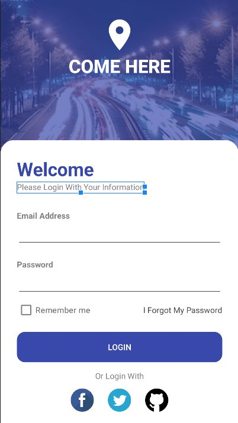
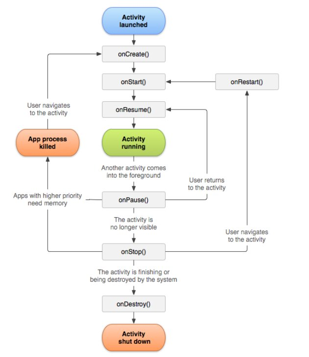

# Android-Applications

- adding internet permissions to the application

```xml
<uses-permission android:name="android.permission.INTERNET"></uses-permission>
```

- HTTP client for kotlin

```gradle
dependencies{
    ...
    implementation "com.squareup.retrofit2:retrofit:2.9.0"
    implementation "com.squareup.retrofit2:converter-gson:2.0.0"
}
```

```gradle
    // system UI Controller
    implementation("com.google.accompanist:accompanist-systemuicontroller:0.27.0")

    // Extended Icons
    implementation("androidx.compose.material:material-icons-extended:1.5.4")

    // Navigation
    implementation ("androidx.navigation:navigation-compose:2.7.5")
```

## JetPack Compose

## Application 001



- HorizontalPager
- VerticalPager

## Activity Life Cycle



```sh
oncreate()
    |
 onstart()
    |
 onresume()
    |
 onpause()
    |
 onstop()
    |
 ondestroy()
```

## Tasks, Back Stack & Launch Modes

- Types of launch Modes
  - Single Top
  - Single Task
  - Single Instance

## ViewModels

- View -> ViewModel -> Model
  
